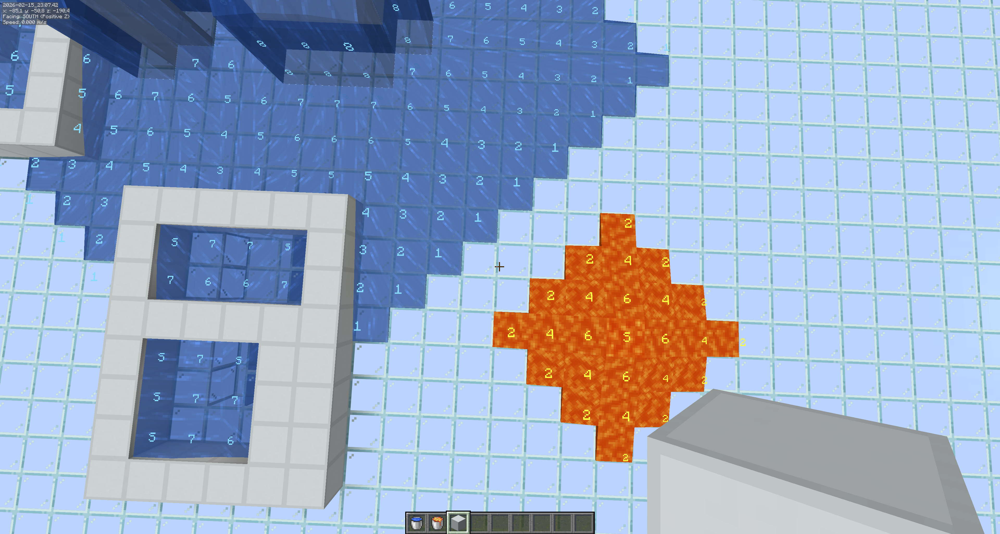

# Fluid Levels

A client-side Fabric mod that displays water and lava fluid levels directly in the game world. Perfect for technical Minecraft players who need to see fluid mechanics at a glance.

## Features

- Shows fluid level numbers floating above each fluid block
- **Source blocks** display "S"
- **Flowing fluids** display levels 7 down to 1 (7 = closest to source)
- **Falling fluids** show the level value (matching F3 debug menu)
- Toggle on/off with **F7**

## Supported Versions

| Minecraft | Java |
|-----------|------|
| 1.20.1    | 17+  |
| 1.20.4    | 17+  |
| 1.21.1    | 21+  |
| 1.21.4    | 21+  |
| 1.21.6    | 21+  |
| 1.21.7    | 21+  |
| 1.21.8    | 21+  |
| 1.21.11   | 21+  |

Download the JAR that matches your Minecraft version.

## Requirements

- [Fabric Loader](https://fabricmc.net/use/installer/)
- [Fabric API](https://modrinth.com/mod/fabric-api)

## Usage

Press **F7** to toggle the display. Source blocks show **S**, all other fluids show their level (1-8) as seen in F3.

## License

MIT
